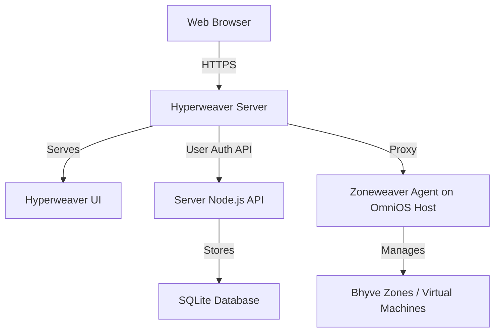

# Hyperweaver Server Documentation

{: .fs-9 }

Hyperweaver Server is the control-plane server for the Hyperweaver platform. It serves the Hyperweaver UI and provides user management, organization control, and proxying to host agents (the Zoneweaver Agent for Bhyve/OmniOS) for managing virtual machines.
{: .fs-6 .fw-300 }

[Get started now](#getting-started){: .btn .btn-primary .fs-5 .mb-4 .mb-md-0 .mr-2 }
[View API Reference](api/){: .btn .fs-5 .mb-4 .mb-md-0 }
[View on GitHub](https://github.com/Makr91/hyperweaver-server){: .btn .fs-5 .mb-4 .mb-md-0 }

---

## Getting started

Hyperweaver Server is the control-plane component of the Hyperweaver platform. It provides user authentication, organization management, and a web interface (the Hyperweaver UI) for managing virtual machines through host agents.

### Key Features

- **User Management**: Complete user authentication and authorization system
- **Multi-Organization Support**: Organization-based access control and management
- **Agent Management**: Configure and manage multiple host-agent connections
- **Web Interface**: Serves the Hyperweaver UI (a React SPA) for management
- **API Integration**: RESTful API for user/organization management and agent proxying
- **Responsive Design**: Mobile-friendly interface for on-the-go management

### Architecture

### Quick start

1. **Installation**: Install Hyperweaver Server via the `.deb` package or build from source
2. **Configuration**: Configure settings in `/etc/hyperweaver-server/config.yaml`
3. **Setup**: Create initial organization and admin user
4. **Agent Connection**: Configure host-agent (Zoneweaver Agent) connections
5. **Access**: Open the web interface and start managing machines

### Documentation

- **[API Reference](api/)** - Server API for user/organization management
- **[Getting Started Guide](guides/getting-started/)** - Step-by-step setup instructions
- **[Installation Guide](guides/installation/)** - Installation and deployment
- **[Backend Integration](guides/backend-integration/)** - Connecting to host agents

---

## About the project

Hyperweaver Server is &copy; 2025 by the Hyperweaver Project.

### License

Hyperweaver Server is distributed under a [GPL-3.0 license](https://github.com/Makr91/hyperweaver-server/blob/main/LICENSE.md).

### Contributing

When contributing to this repository, please first discuss the change you wish to make via issue, email, or any other method with the owners of this repository before making a change. Read more about becoming a contributor in [our GitHub repo](https://github.com/Makr91/hyperweaver-server#contributing).

#### Thank you to the contributors of Hyperweaver Server!

<ul class="list-style-none">

  <li class="d-inline-block mr-1">
     
  </li>

</ul>

### Code of Conduct

Hyperweaver Server is committed to fostering a welcoming community.

[View our Code of Conduct](https://github.com/Makr91/hyperweaver-server/tree/main/CODE_OF_CONDUCT.md) on our GitHub repository.
